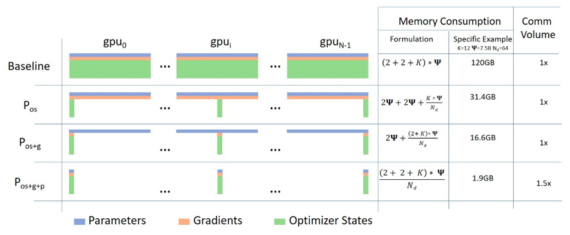

# What is this Exercise About?

This exercise explores large language model (LLM) fine-tuning using DeepSpeed, a deep learning optimization library for
large-scale training. The workshop walks through a practical progression:

1. Baseline fine-tuning using Hugging Face Trainer **without** DeepSpeed.

2. Fine-tuning on a single GPU using DeepSpeed with different ZeRO optimization stages.

3. Comparing ZeRO stages with and without CPU offloading.

4. Evaluating memory usage and performance trade-offs across configurations.

5. Scaling up to multi-GPU and multi-node training using DeepSpeed's distributed launcher.

## Why DeepSpeed?

Training such large models is computationally expensive and quickly runs into memory limits — especially on a single
GPU.

DeepSpeed is a deep learning optimization library from Microsoft designed to:

- **Reduce GPU memory usage** via ZeRO optimizations (stage 1–3).

- **Enable distributed training** across GPUs and even nodes.

- Support **model and tensor parallelism**.

- Work seamlessly with **Hugging Face Transformers**.

## What is Hugging Face 🤗?

**Hugging Face** is an open-source ecosystem built around natural language processing (NLP) and machine learning
models — especially transformer-based models like BERT, GPT, and BLOOM.

It provides easy-to-use tools to **download, train, fine-tune, and deploy** state-of-the-art models with just a few
lines of code.

### 🔧 Key Components You'll Use

| Component      | What It Does                                                                                        |
|----------------|-----------------------------------------------------------------------------------------------------|
| `transformers` | Python library for accessing thousands of pre-trained models across NLP, vision, and audio tasks.   |
| `datasets`     | Library for easy loading, sharing, and preprocessing of public datasets like SQuAD, IMDB, and more. |
| `Trainer` API  | High-level training interface to handle training, evaluation, and checkpointing with minimal code.  |
| Model Hub      | Online platform for hosting, sharing, and downloading models — all ready to use.                    |

---
In this workshop, you’ll:

- Use `transformers` to load a pre-trained **BLOOM** model.
- Use `datasets` to load and preprocess a **SQuAD** subset.
- Fine-tune the model on a **question-answering task** using the `Trainer` API.
- Later, enhance scalability using **DeepSpeed** for memory- and compute-efficient training.

## Learning Outcomes

### By the end of this exercise, participants will be able to:

1. Understand the **basics of fine-tuning** transformer models **using Hugging Face and DeepSpeed**.

2. Configure DeepSpeed for **ZeRO Stage 1, 2, and 3**, with and without offloading.

3. Measure and interpret training **performance, memory footprint, and scalability** across setups.

4. Launch **distributed** training jobs on **multiple GPUs and across multiple nodes**.

---

# Environment Setup

We'll use Conda to manage packages and dependencies

run these lines:

```bash
conda env create -f environment.yml
conda activate deepspeed-finetune
```

---

#  Repository Structure
```
.
├── scripts/                      # Core Python modules used across all training jobs
│   ├── train.py                  # Launches training with HF Trainer and DeepSpeed
│   ├── data_loader.py            # Loads and tokenizes dataset (e.g., SQuAD)
│   ├── model.py                  # Loads model and tokenizer (e.g., BLOOM)
│   └── config.py                 # Central config for training args and CLI parsing
│   └── analyze_memory.py         # Parses GPU/CPU memory logs and summarizes peak/avg/mode usage
│
├── ds_configs/                   # DeepSpeed configuration JSON files
│   ├── zero0.json
│   ├── zero1.json
│   ├── zero2_cpu_offload.json
│   ├── zero2_cpu_offload_pinned_memory.json
│   └── ...
│
├── experiments/                  # SLURM job scripts organized by context
│   ├── deepspeed-single-gpu/
│   │   ├── zero_0/
│   │   ├── zero_1/
│   │   ├── zero_2/
│   │   └── ...
│   └── deepspeed-multi-node/
│       ├── 2_nodes/
│       ├── 3_nodes/
│       ├── 4_nodes/
│       └── ...
│
├── log/                          # SLURM job logs (output generated at runtime)
├── gpu_memory/                   # GPU memory logs (generated at runtime)
├── cpu_memory/                   # CPU memory logs (generated at runtime)
│
└── README.md                     # Workshop guide and documentation

```
## What Each Folder Contains

### `scripts/`
Contains the core Python logic:

- `train.py`: Orchestrates training with Hugging Face Trainer and DeepSpeed.

- `data_loader.py`: Prepares and tokenizes datasets like SQuAD.

- `model.py`: Loads the pretrained model and tokenizer (e.g., BLOOM).

- `config.py`: Parses CLI arguments and sets up TrainingArguments.

- `analyze_memory.py`: CLI tool that reads memory logs and reports:

    - GPU: average, mode, and peak per GPU

    - CPU: average, mode, and peak physical memory

    - Optional CLI flags: `--cpu-only`, `--gpu-only`

### `ds_configs/`

- Holds all DeepSpeed `JSON` configuration files. Each file defines a different ZeRO stage or offloading strategy used in the exercises.

experiments/
Organized by training scenario:

- baseline/: Runs without DeepSpeed — establishes performance and memory usage reference points.

- deepspeed-single-gpu/: Individual subfolders for each ZeRO stage and offloading variant on a single GPU.

- deepspeed-multi-gpu/: Training across multiple GPUs on a single node.

- deepspeed-multi-node/: Weak scaling experiments over 2–6 nodes, each in its own folder.

- Each subfolder contains its SLURM script and output directories (log/, gpu_memory/, cpu_memory/).

### `log/`, `gpu_memory/`, `cpu_memory/`
Automatically created during training runs:

- `log/`: SLURM job output logs.

- `gpu_memory/<job_id>/`:  One or more (if multi node) `.csv` files, sampled via `nvidia-smi`

- `cpu_memory/<job_id>/`:  One .txt file per run, captured with `psrecord`.

### `README.md`
The central guide for running the workshop, explaining DeepSpeed, ZeRO stages, config tuning, how to extract metrics, and more.

---

# Baseline: BLOOM Fine-tuning without DeepSpeed:

## Fine-Tuning Setup

Before exploring `DeepSpeed` optimizations, it’s useful to understand the vanilla `HuggingFace` fine-tuning process
using a smaller LLM like `bigscience/bloom-560m`, and 500 examples subset of `SQuAD` for question-answer format
training.

### Model Loader and Saver

[model.py](scripts/model.py) defines two key functions:

1. `load_model()`: Loads `bigscience/bloom-560m` model and tokenizer.

2. `save_model()`: Saves the trained model and tokenizer to disk.

### Dataset Preprocessing

[data_loader.py](scripts/data_loader.py) Handels:

1. Loading the SQuAD dataset using Hugging Face datasets.

2. Tokenizing each example as:
    ```
    "Question: ... Context: ... Answer: ..."
    ```
3. Padding/truncating to max length (512).

4. Setting labels = input_ids (for causal LM).

5. Optionally subsetting the dataset for faster experiment.

### Training Configuration

[config.py](scripts/config.py) centralizes hyperparameters makes tuning and experimenting easier — change config values
in one file without touching the training script, it handles different DeepSpeed configurations using the CLI without
touching code.
This section defines the core training hyperparameters and behaviors using the Hugging Face

- `output_dir`:`./bloom-qa-finetuned`    Directory to store model checkpoints, logs, and evaluation results.
- `eval_strategy`:`epoch`    Evaluation is run at the end of each training epoch.
- `save_strategy`:`epoch`    A model checkpoint is saved at the end of each training epoch.
- `per_device_train_batch_size`:`4`    Batch size to use on each GPU or each CPU worker during training.
- `per_device_eval_batch_size`:`4`    Batch size to use on each device during evaluation.
- `gradient_accumulation_steps`:`4`    Number of steps to accumulate gradients before performing a backward/update pass.
  Simulates a larger effective batch size.
- `num_train_epochs`:`3`    Total number of training epochs (full passes through the dataset).
- `learning_rate`:`5e-5`    Initial learning rate for the optimizer.
- `weight_decay`:`0.01`    Weight decay (L2 penalty) to apply for regularization. Helps prevent overfitting.
- `fp16`:`True`    Enables automatic mixed precision (AMP) training for reduced memory usage and faster computation (
  requires compatible hardware).
- `gradient_checkpointing`:`False`    Disables gradient checkpointing. If set to True, it reduces memory usage by
  trading off compute time.
- `push_to_hub`:`False`    Disables automatic pushing of the model and logs to the Hugging Face Hub. Set to True if you
  want to share your model publicly or privately.
- `deepspeed`:Provided via `--deepspeed` CLI flag; enables DeepSpeed config loading at runtime.

### Training

The [train.py](scripts/train.py) script fine-tunes a causal language model (e.g., BLOOM) using Hugging Face's Trainer
API.

**Hugging Face Trainer:**

The Trainer class from Hugging Face simplifies the process of training and evaluating models — especially useful when
working with transformers, tokenizers, and large datasets.
Instead of writing your own training loop with forward(), backward(), optimizer steps, and logging — Trainer handles it
for you.

**What Happens When You Call `trainer.train()`?**

- Batches the dataset using the data collator
- Moves data to GPU if available
- Runs model(input_ids) and computes the loss
- Applies backpropagation (loss.backward() + optimizer step)
- Saves checkpoints and logs progress
- Evaluates on the validation set (if provided)

### SLURM Job Submission Script

[baseline.slurm](experiments/baseline/baseline.slurm) is used to run the entire experiment on an HPC cluster.

**Key sections:**

- `#SBATCH` directives define resources: 1 GPU, 32GB RAM, 12 hours.

- Activates your Conda env and loads CUDA module.

- Starts nvidia-smi memory logging in the background.

- Executes python [train.py](scripts/train.py).

- Kills memory logger afterward.

### Bringing It All Together: Running the Baseline Fine-Tuning Experiment

Once all components are in place — model loading, dataset preprocessing, training configuration, and training logic —
you can execute the full fine-tuning workflow with minimal manual steps.

Use the baseline.slurm script to submit the training job on a GPU node:

```commandline
sbatch baseline.slurm
```

### Output Artifacts

After your SLURM job completes, the following artifacts will be generated:

| **Artifact Type**    | **Location**                             | **Description**                                                |
|----------------------|------------------------------------------|----------------------------------------------------------------|
| **Fine-Tuned Model** | `./bloom-qa-finetuned/`                  | Contains model weights, config, and tokenizer files            |
| **SLURM Log**        | `log/<job-name>-<job_id>.out`            | Console output including training progress and evaluation logs |
| **GPU Memory Log**   | `gpu_memory/gpu_memory_log_<job_id>.csv` | Periodic memory usage from `nvidia-smi`                        |
| **CPU Memory Log**   | `cpu_memory/cpu_memory_log_<job_id>.txt` | RAM usage sampled over time using `psrecord`                   |

---

## Exercise: Run the Baseline Training & Fill Evaluation Summary Table

As part of this workshop, your task is to **run the baseline fine-tuning experiment** and **recreate the performance
summary table** using your own training logs.

This exercise helps you develop a habit of tracking key metrics like training loss, evaluation loss, and throughput —
which are essential for understanding and debugging model training.

### Part 1: Run the Baseline Fine-Tuning Job

#### Steps:

1. Navigate to the [baseline](experiments/baseline) directory
    ```bash
    cd experiments/baseline
    ```
2. Submit the slurm script [baseline.slurm](experiments/baseline/baseline.slurm)
    ```bash
    sbatch baseline.slurm
    ```
3. Once the job is terminated, check logs:

   Output logs found in `.out` inside [log](experiments/baseline/logs) directory, it should be tailed with the slurm job
   id.
     ```bash
     cd log
     cat <job_name>_<job_id>.out
     ```
    - You will see lines similar to:
   
    ```commandline
    100%|██████████| 93/93 [02:02<00:00,  1.10s/it]
    {'eval_loss': 1.2965, 'eval_runtime': 1.267, 'eval_samples_per_second': 39.46, ...}
    {'train_runtime': 133.21, 'train_samples_per_second': 11.26, 'train_loss': 0.7039, ...}
    ✅ Model and tokenizer saved to ./bloom-finetuned
   
   GPU Memory Usage
    [gpu_memory_log - GPU 0] Peak = 21658 MiB, Avg = 18683.53 MiB, Mode = 21658 MiB

    CPU Memory Usage
       Peak =    3892 MB
       Average = 2276.06 MB
       Mode =    2145, 2177 MB
    ```
4. Fill the results table:

   Extract the following metrics from the output log and populate the table below:

| **Category**         | **Metric**                  | **Extraction Instruction**                                                       | **Your Value** |
|----------------------|-----------------------------|----------------------------------------------------------------------------------|----------------|
| **Training Metrics** | Final Train Loss            | Last `'train_loss': ...` from output log                                         |                |
|                      | Eval Loss (Epoch 1)         | `'eval_loss': ...` with `'epoch': 1.0`                                           |                |
|                      | Eval Loss (Epoch 2)         | `'eval_loss': ...` with `'epoch': 2.0`                                           |                |
|                      | Eval Loss (Final)           | Last `'eval_loss': ...` line (e.g., `'epoch': 2.93`)                             |                |
|                      | Train Samples/sec           | `'train_samples_per_second': ...`                                                |                |
|                      | Eval Samples/sec            | Any `'eval_samples_per_second': ...` line (e.g. epoch 1)                         |                |
|                      | Steps per Epoch             | Like at `93/93` in the progress bar                                              |                |
| **GPU Memory**       | Peak Usage (MiB)            | From script output  `[gpu_memory_log - GPU 0] Peak = `                           |                |
|                      | Average Usage (MiB)         | From script output  `[gpu_memory_log - GPU 0] ... Avg =  `                       |                |
|                      | Mode Usage (MiB)            | Most frequent memory from script output  `[gpu_memory_log - GPU 0] ... Mode =  ` |                |
| **CPU Memory**       | Peak Usage (MB)             | From script output  ` CPU Memory Usage ... Peak = `                              |                |
|                      | Average Usage (MB)          | From script output  ` CPU Memory Usage ... Average = `                           |                |
|                      | Mode Usage (MB)             | Most frequent Real from script output  ` CPU Memory Usage ... Mode = `           |                |

---

# DeepSpeed-Zero on Single Node Single GPU:

## DeepSpeed Configuration File:

The DeepSpeed config file is the central interface through which
you control how DeepSpeed integrates with your training pipeline. It acts like a blueprint that tells DeepSpeed how to
optimize and manage.

A basic example of ds_config.json is available [here](ds_configs/zero0.json) for reference.

### Parameter Descriptions

Below are the key settings used throughout this workshop. These form the foundation for later ZeRO configurations:

| **Key**                         | **Value**      | **Description**                                                                                 |
|---------------------------------|----------------|-------------------------------------------------------------------------------------------------|
| `train_batch_size`              | `"auto"`       | Automatically sets the largest batch size that fits into GPU memory.                            |
| `gradient_accumulation_steps`   | `"auto"`       | Automatically determines the number of accumulation steps to simulate larger batch sizes.       |
| `gradient_clipping`             | `1.0`          | Caps gradient norms to prevent exploding gradients and ensure training stability.               |
| `optimizer.type`                | `"AdamW"`      | Optimizer used for training; AdamW is standard for transformer models.                          |
| `optimizer.params.lr`           | `5e-5`         | Learning rate used for fine-tuning.                                                             |
| `optimizer.params.betas`        | `[0.9, 0.999]` | Beta values used by Adam optimizer for momentum calculations.                                   |
| `optimizer.params.eps`          | `1e-8`         | Small constant added to prevent division by zero during optimization.                           |
| `optimizer.params.weight_decay` | `0.01`         | Regularization parameter to prevent overfitting.                                                |
| `fp16.enabled`                  | `true`         | Enables Automatic Mixed Precision (AMP) for faster and more memory-efficient training.          |
| `zero_optimization.stage	`      | `0`            | No ZeRO optimization yet — used for compatibility with DeepSpeed's integration in Hugging Face. |

[Official documentation for DeepSpeed Configuration JSON]( https://www.deepspeed.ai/docs/config-json/)

> **Note:** `zero_optimization.stage = 0` does not activate ZeRO but satisfies DeepSpeed’s required structure.
>
>**More on ZeRO optimization (Stage 1, 2, and 3) will be covered in a later section.**

## Turning the Baseline into a DeepSpeed-Enabled Trainer

In the baseline setup, the `Trainer` uses Hugging Face’s standard training loop without any DeepSpeed optimizations.

To integrate DeepSpeed into the training pipeline, the `TrainingArguments` class must reference a DeepSpeed
configuration file `<ds_config>.json`. This allows Hugging Face's Trainer to apply DeepSpeed's optimization features
during training.

### Running the Script with DeepSpeed

The training process is launched using the **standard Python command**.  
DeepSpeed still initializes and applies all runtime optimizations through its integration with the Hugging Face
`Trainer` API.

To ensure DeepSpeed is activated, pass the config file using the `--deepspeed` argument when launching the script:
```bash
python -m torch.distributed.run --rdzv_endpoint=$master_ip:$master_port scripts/train.py --deepspeed ./<ds_config>.json
```
>You need an explicit `rdzv endpoint` so all distributed processes can find each other and to avoid port collisions with the default address (29500) when multiple runs launch simultaneously.

### Modification to `TrainingArguments`

To enable DeepSpeed, a single line is added:

```python
    deepspeed = "./ds_config.json",  # Links the DeepSpeed configuration file
```

> In our setup, we allow the `--deepspeed` path to be passed dynamically at runtime via command-line arguments.
>
>This means no manual editing of the script is needed to switch between configurations — just pass the desired `JSON`
> via the `--deepspeed` and it will be integrated directly into Hugging Face’s training loop.

**This integration allows DeepSpeed to handle aspects such as:**

- Mixed-precision training (FP16)

- Gradient accumulation and clipping

- Optimizer configuration

## ZeRO in DeepSpeed

**ZeRO** (Zero Redundancy Optimizer) reduces memory usage by partitioning model states across devices.
ZeRO is applied in three progressive stages, each targeting a different component of the training state:

- Stage 1: Partitions **optimizer** states

- Stage 2: Partitions **optimizer** states and **gradients**

- Stage 3: Partitions **optimizer** states, **gradients**, and model **parameter**



### Stage 1: Optimizer State Partitioning

**What it does:**

- Reduces memory footprint by not replicating optimizer states on every GPU.
- Each GPU only keeps its own partition of the optimizer state tensors.
- Model parameters and gradients are still fully replicated across devices.

On **single GPU**, there's no sharding — so optimizer state partitioning won't reduce memory use.

#### How to Enable ZeRO Stage 1

To activate ZeRO Stage 1 optimization, update the DeepSpeed config by setting:

```json
  "zero_optimization": {
"stage": 1
}
```

No Python code changes are needed.

#### Optimizer State Offloading (Stage 1 with Offload)

In case your model is still hitting memory limits or you'd like to further reduce GPU memory pressure, you can offload
the optimizer state to CPU.

This is particularly useful for:

- Single GPU setups with tight memory
- Larger batch sizes or long sequence lengths

To enable Optimizer State Offloading, modify your configuration to include:

```json
  "zero_optimization": {
"stage": 1,
"offload_optimizer": {
"device": "cpu"
}
}
```

### Stage 2: + Gradient Partitioning

What it adds:

- Reduces activation memory and gradient memory on each GPU.
- Makes training larger models possible on limited memory.

Configure your DeepSpeed setup with the following parameters, to activate it:

```python
  "zero_optimization": {
    "stage": 2
}
```

#### Stage 2 + Offloading provides best memory savings by:

- Offloading optimizer states,

- Offloading gradient states,

Apply this setting to the DeepSpeed configuration file:

```json
  "zero_optimization": {
"stage": 2,
"offload_optimizer": {
"device": "cpu"
}
}
```

### Zero 3 Full Parameter Sharding (No Offloading)

**ZeRO Stage 3** is the most memory-efficient stage of DeepSpeed’s ZeRO (Zero Redundancy Optimizer) family. It builds on
Stages 1 and 2 by additionally sharding the **model parameters themselves**, not just optimizer states or gradients.

This stage allows training very large models by distributing:

- **Optimizer states** (as in Stage 1)
- **Gradients** (as in Stage 2)
- **Model parameters** (new in Stage 3)

Use the configuration snippet below in your DeepSpeed setup.

```json
  "zero_optimization": {
"stage": 3
}
```

#### ZeRO Stage 3: Full Parameter Offloading

ZeRO Stage 3 (Parameter + Gradient + Optimizer Sharding) is the most memory-efficient optimization level in DeepSpeed’s
ZeRO suite. It goes beyond Stage 2 by partitioning model parameters themselves across GPUs, not just the optimizer and
gradient states.

**What It Does**

- Partitions:
    - Optimizer states (like Stage 1)
    - Gradients (like Stage 2)
    - Model parameters (new in Stage 3)
- Reduces peak memory usage drastically during training
- Enables very large models to be trained on fewer GPUs.

Enable this feature in your DeepSpeed config by including:

```json
  "zero_optimization": {
"stage": 3,
"offload_optimizer": {
"device": "cpu"
},
"offload_param": {
"device": "cpu"
}
}
```

### Offloading: Parameters:`pin_memory: true`

#### In the context of DeepSpeed offloading, setting pin_memory: true enables:

- **Page-locked** (pinned) memory allocation on the host (CPU).
- **Faster transfers** between CPU and GPU because pinned memory allows asynchronous **DMA** (direct memory access),
  which allows devices like GPUs to **read/write memory directly, without CPU intervention.** This means:
    - The **GPU** can **pull/push** offloaded tensors from/to CPU faster.
    - The **CPU** is **not stalled** waiting for transfers to complete.
    - Data can be transferred **while computation** is still happening — overlapping compute and memory I/O.
- Improved data pipeline throughput, especially noticeable in single-GPU training where the offloaded optimizer is
  frequently accessed.

For Optimizer Offloading:

```json
    "offload_optimizer": {
"device": "cpu",
"pin_memory": true
}
```

For Parameter Offloading:

```json
    "offload_param": {
"device": "cpu",
"pin_memory": true
}
```

### Tracking CPU Memory Usage

When using DeepSpeed with ZeRO stages — especially with CPU offloading — it's important to monitor not only GPU memory,
but also CPU memory, since model states or optimizer states can be moved to CPU RAM.

This section demonstrates how to extend a SLURM job script to track both GPU and CPU memory usage using nvidia-smi and
psrecord:

1. **Background the Training job:**
    ```
   # Launch the training script with DeepSpeed in the background
   python -m torch.distributed.run --rdzv_endpoint=$master_ip:$master_port scripts/train.py --deepspeed <ds_config>.json &
   # Capture the PID of the DeepSpeed training process for later monitoring or cleanup
   TRAIN_PID=$!
   ```
    - The training command is launched **in the background** (`&`) so the script can capture its PID (`$!`).
    - This is necessary for psrecord to **attach** to and **monitor** the correct process.


2. **Add CPU Memory Monitoring with `psrecord`**:
    ```commandline
    # Start CPU memory logging in the background for the DeepSpeed process (including its children),
    # sampling every 5 seconds and writing to the specified log file
    psrecord $TRAIN_PID --include-children --interval 5 --log "deepspeed-cpu-offloading-data-finetune${SLURM_JOB_ID}.txt" &
    
    # Capture the PID of the psrecord process so it can be terminated after training finishes
    MONITOR_CPU_PID=$!
    ```
    - `psrecord` tracks memory usage of the training process.
    - `--include-children` ensures subprocesses like optimizer workers or data loaders are included.
    - `--interval` 5 matches the GPU log sampling rate.
    - `--log writes` memory usage to a timestamped text file.


3. **Wait for the Training to Finish**
    ```
   # Wait for the DeepSpeed training process to complete before stopping any logging or cleanup
    wait $TRAIN_PID
    ```
    - Ensures the script pauses until training completes.
    - Prevents premature termination of memory logging processes.


4. **Stop Logging Process**
    ```
   # Stop the CPU memory logging process now that training has finished
    kill $MONITOR_CPU_PID
    ```
    - Cleans up both GPU and CPU memory logging processes after training ends.

---

## Exercise: Benchmarking ZeRO Stages with CPU Offloading

This section walks through how to:

1. Fill the full benchmarking table comparing ZeRO stages.
2. Modify model size and dataset subset for deeper experimentation.

---

### Fill the ZeRO Stage Comparison Table

#### How to Change Model and Dataset Subset Size

This section explains how to modify the model and dataset subset to perform benchmarking on larger-scale scenarios.

### ZeRO Stage Comparison Table (Fill in the Missing Values)

| **DeepSpeed Config**      | **Submit Training Job**                                                                              | **Peak GPU Memory Used (MiB)** | **Average GPU Memory Used (MiB)** | **Peak CPU Memory Used (MiB)** | **Average CPU Memory Used (MiB)** | **Train Samples/Second** |
|---------------------------|------------------------------------------------------------------------------------------------------|--------------------------------|-----------------------------------|--------------------------------|-----------------------------------|--------------------------|
| ZeRO Stage 1 + Offloading | `cd experiments/deepspeed-single-gpu/cpu_offloading/zero_1/ && sbatch deepspeed_zero1_offload.slurm` |                                |                                   |                                |                                   |                          |
| ZeRO Stage 2 + Offloading | `cd experiments/deepspeed-single-gpu/cpu_offloading/zero_2/ && sbatch deepspeed_zero2_offload.slurm` |                                |                                   |                                |                                   |                          |
| ZeRO Stage 3 + Offloading | `cd experiments/deepspeed-single-gpu/cpu_offloading/zero_3/ && sbatch deepspeed_zero3_offload.slurm` |                                |                                   |                                |                                   |                          |

#### Extracting Metrics

| **Step**                  | **Command / Instruction**                                                                 |
|---------------------------|-------------------------------------------------------------------------------------------|
| Check training summary    | Find `train_samples_per_second` in the final summary inside `log/<JOB_NAME>_<JOB_ID>.out` |
| Peak GPU Memory (MiB)     | From script output `[gpu_memory_log - GPU 0] Peak =`                                      |
| Avg GPU Memory (MiB)      | From script output `[gpu_memory_log - GPU 0] ... Avg =`                                   |
| Mode for GPU Memory (MiB) | Most frequent memory from script output  `[gpu_memory_log - GPU 0] ... Mode =  `          |
| Peak CPU Memory (MiB)     | From script output `CPU Memory Usage ... Peak = `                                         |
| Avg CPU Memory (MiB)      | From script output `CPU Memory Usage ... Average = `                                      |
| Mode for CPU Memory (MiB  | Most frequent Real from script output  ` CPU Memory Usage ... Mode = `                    |

### Quiz Questions:

Use your completed memory and runtime benchmark tables to answer the following questions for each part.

1. Which ZeRO stage gave the lowest peak GPU memory usage on each bloom variation?

2. How does runtime change when offloading is enabled across ZeRo stages?

---

## DeepSpeed-Zero on Single Node Multi GPUs:

This section describes how to adapt a single-GPU DeepSpeed setup to fine-tune a large model across
multiple GPUs on one node.

### Setting-up Multi GPUs Training:

To recreate this multi-GPU fine-tuning setup for BLOOM-560M using DeepSpeed, you'll begin with your working single-GPU
Hugging Face + DeepSpeed setup and make a few targeted changes. Below is a full explanation of the required
modifications and an overview of how DeepSpeed handles GPU sharding.

#### Step 1: Adjust SLURM directives for 2 GPUS per node for example:

```commandline
#SBATCH --gpus=2                               # Request 2 GPU
#SBATCH --gpus-per-node=2                      # 2 GPUs per node
```

#### Step 2: Set up DeepSpeed master address and port:

Place these lines before the training command in
the [SLURM](experiments/deepspeed-single-gpu/zero_0/deepspeed_zero0.slurm) script:

```commandline
export MASTER_ADDR=$(scontrol show hostnames $SLURM_JOB_NODELIST | head -n 1)  # Hostname or IP of the master node for NCCL initialization
export MASTER_PORT=$(python -c 'import socket; s=socket.socket(); s.bind(("", 0)); print(s.getsockname()[1]); s.close()')    # Dynamically find a free TCP port on the current node to use as the rendezvous port.
export WORLD_SIZE=$SLURM_GPUS_ON_NODE                                        # Total number of GPUs being used on this node
export RANK=0                                                                 # Global rank of this process (0 for single-node jobs)
export LOCAL_RANK=0                                                           # Local GPU index for this process (0–N-1)
```

These environment variables configure distributed training manually.

- `MASTER_ADDR`: IP or hostname of main node (for NCCL initialization).

- `MASTER_PORT`: The Python one-liner creates a socket, binds it to port 0 (let OS choose an available port).

- `WORLD_SIZE`: Total number of GPUs (set automatically by SLURM).

- `RANK` and LOCAL_RANK: Needed for some custom multi-node setups.

#### Step 3: Use the Python Launcher with

```commandline
python -m torch.distributed.run --nproc_per_node=$SLURM_GPUS_ON_NODE  --rdzv_endpoint=$master_ip:$master_port scripts/train.py --deepspeed ds_configs/zero2_cpu_offload_pinned_memory.json &
```

This command launches **distributed training** on **all GPUs in the current node**, using PyTorch’s recommended
launcher (
`torch.distributed.run`).

---

## Exercise: Benchmarking Multi-GPU DataParallel Training

### Part 1: Scaling on Multi-GPU Setup

This exercise walks through how to measure and tabulate key training metrics for `BLOOM-560M` on a 500 sample subset,
using DeepSpeed’s DataParallel (no ZeRO) across 2, 4, 6, and 8 GPUs.

Run the same training script with `#SBATCH --gpus-per-node=N` for **N = 2, 4, 6, 8**, then record:

- **Train Runtime** (total seconds)
- **Steps/sec** (extracted from logs or computed)
- **Samples/sec** (`Steps/sec × per_device_train_batch_size × N`)
- **Train Loss** (final)
- **Eval Loss** (final)
- **Eval Speed** (samples/sec during evaluation)
- **Peak GPU Memory** (per GPU)

**What Is Weak Scaling?**

Weak scaling refers to how well a system handles increasing workload proportional to the number of compute resources.

- You increase the dataset size as you increase the number of GPUs or nodes.
- Each GPU processes the same amount of data, regardless of how many GPUs are used.

For example, if the base is 500 samples per GPU:

- **2 GPUs** → 500 samples
- **4 GPUs** → 1000 samples
- **6 GPUs** → 1500 samples
- **8 GPUs** → 2000 samples

#### Automating Weak Scaling in [train.py](scripts/train.py)

This snippet shows how to compute the dataset subset size automatically based on the number of GPUs available (
weak-scaling mode).

```python
import os

# Define the base number of samples **per GPU**
base_size = 500

# Detect number of GPUs (DeepSpeed / SLURM will set WORLD_SIZE)
#    Fallback to 1 ifWORLD_SIZE is not set
num_gpus = int(os.environ.get("WORLD_SIZE", 1))

# Compute total subset size = base_size × num_gpus
subset_size = base_size * num_gpus

# Load and tokenize only that many examples
tokenized_datasets = load_squad(subset_size=subset_size)
```

### Fill in the results for each GPU count below.

| **Metric**                 |                                                                    **2 GPUs** |                                                                    **4 GPUs** |                                                                    **8 GPUs** |
|----------------------------|------------------------------------------------------------------------------:|------------------------------------------------------------------------------:|------------------------------------------------------------------------------:|
| Submit Job                 | `cd experiments/deepspeed-multi-gpu/2_gpus/ && sbatch deepspeed_2_gpus.slurm` | `cd experiments/deepspeed-multi-gpu/4_gpus/ && sbatch deepspeed_4_gpus.slurm` | `cd experiments/deepspeed-multi-gpu/8_gpus/ && sbatch deepspeed_8_gpus.slurm` |
| Train Samples/sec          |                                                                               |                                                                               |                                                                               |
| Train Loss                 |                                                                               |                                                                               |                                                                               |
| Peak GPU Memory (MiB)      |                                                                               |                                                                               |                                                                               |
| Average GPU Memory (MiB)   |                                                                               |                                                                               |                                                                               |
| Mode for GPU Memory (MiB)  |                                                                               |                                                                               |                                                                               |

#### Extracting Metrics

| **Step**                  | **Command / Instruction**                                                                 |
|---------------------------|-------------------------------------------------------------------------------------------|
| Check training summary    | Find `train_samples_per_second` in the final summary inside `log/<JOB_NAME>_<JOB_ID>.out` |
| Peak GPU Memory (MiB)     | From script output `[gpu_memory_log - GPU 0] Peak =`                                      |
| Avg GPU Memory (MiB)      | From script output `[gpu_memory_log - GPU 0] ... Avg =`                                   |
| Mode for GPU Memory (MiB) | Most frequent memory from script output  `[gpu_memory_log - GPU 0] ... Mode =  `          |

### Quiz Questions

1. Given weak scaling, should **Peak GPU Memory** per GPU remain constant? Explain any deviations you observe.

---

### part 2: 2-GPU ZeRO Stage Comparison

This exercise guides the measurement and comparison of training metrics for ZeRO Stages 1, 2, 3 on **2 GPUs**, each
**with** and **without** CPU offloading.
Fill in the results for ZeRO Stages 1, 2, and 3 on **2 GPUs**, both **with** and **without** CPU offloading.

|                            | **Stage 1**                                                                                                  | **Stage 2**                                                                                                  | **Stage 3**                                                                                                  |
|----------------------------|:-------------------------------------------------------------------------------------------------------------|:-------------------------------------------------------------------------------------------------------------|:-------------------------------------------------------------------------------------------------------------|
| Submit Job                 | `cd experiments/deepspeed-multi-gpu/2_gpus_stages_comparison/zero_1/ && sbatch deepspeed_2_gpus_zero1.slurm` | `cd experiments/deepspeed-multi-gpu/2_gpus_stages_comparison/zero_1/ && sbatch deepspeed_2_gpus_zero2.slurm` | `cd experiments/deepspeed-multi-gpu/2_gpus_stages_comparison/zero_1/ && sbatch deepspeed_2_gpus_zero3.slurm` |
| Train Samples/sec          |                                                                                                              |                                                                                                              |                                                                                                              |
| Train Loss                 |                                                                                                              |                                                                                                              |                                                                                                              |
| Peak GPU Memory (MiB)      |                                                                                                              |                                                                                                              |                                                                                                              |
| Average GPU Memory (MiB)   |                                                                                                              |                                                                                                              |                                                                                                              |
| Mode for GPU Memory (MiB)  |                                                                                                              |                                                                                                              |                                                                                                              |
| Peak CPU Memory (MiB)      |                                                                                                              |                                                                                                              |                                                                                                              |
| Average CPU Memory (MiB)   |                                                                                                              |                                                                                                              |                                                                                                              |
| Mode for CPU Memory (MiB)  |                                                                                                              |                                                                                                              |                                                                                                              |

#### Extracting Metrics

| **Step**                  | **Command / Instruction**                                                                 |
|---------------------------|-------------------------------------------------------------------------------------------|
| Check training summary    | Find `train_samples_per_second` in the final summary inside `log/<JOB_NAME>_<JOB_ID>.out` |
| Peak GPU Memory (MiB)     | From script output `[gpu_memory_log - GPU 0] Peak =`                                      |
| Avg GPU Memory (MiB)      | From script output `[gpu_memory_log - GPU 0] ... Avg =`                                   |
| Mode for GPU Memory (MiB) | Most frequent memory from script output  `[gpu_memory_log - GPU 0] ... Mode =  `          |
| Peak CPU Memory (MiB)     | From script output `CPU Memory Usage ... Peak = `                                         |
| Avg CPU Memory (MiB)      | From script output `CPU Memory Usage ... Average = `                                      |
| Mode for CPU Memory (MiB) | Most frequent Real from script output  ` CPU Memory Usage ... Mode = `                    |

> **Note on Code Versioning and SLURM Queues**  
> SLURM does **not** snapshot your Python scripts when you call `sbatch`.
> - The job will execute whatever version of `train.py` (or any other `.py` files) is on disk **at the moment the job
    actually starts** running, not when it was submitted.
> - Any edits made to your code while the job is still in the queue will be picked up automatically.
>
> **Best Practices:**
> Submit from a dedicated directory that won’t be modified.  
> This ensures reproducibility and avoids unintended changes in long-running or queued jobs.
---

## Multi-Node Training with DeepSpeed and torch.distributed

When training large models across multiple nodes, we use PyTorch’s `torch.distributed.run` to launch one training process
per node.

This launcher communicates across nodes using **TCP-based rendezvous**, making it suitable for clusters where direct process
launching across nodes (e.g., via SSH) is restricted or avoided.

Below is a side-by-side of the relevant sections, with **added/modified lines** annotated.

1. SLURM script edits:

- `SBATCH` directives:
    ```commandline
    #SBATCH --nodes=2                                                # Number of nodes to allocate
    #SBATCH --ntasks=2                                               # Number of tasks
    #SBATCH --ntasks-per-node=1                                      # One task (process) per node
    #SBATCH --cpus-per-task=4                                        # Number of CPU cores per task
    #SBATCH --gpus=4                                                 # Request 4 GPU
    #SBATCH --gpus-per-node=2                                        # 2 GPU per node
    ```
- After environment setup lines, determine master node discovery and rendezvous configuration
   ```commandline
   # Getting the node names
   nodes=$(scontrol show hostnames "$SLURM_JOB_NODELIST")
   nodes_array=($nodes)
   echo "Node IDs of participating nodes ${nodes_array[*]}"
        
   # Get the IP address and set port for MASTER node
   head_node="${nodes_array[0]}"
   echo "Getting the IP address of the head node ${head_node}"
   master_ip=$(srun -n 1 -N 1 --gpus=1 -w ${head_node} /bin/hostname -I | cut -d " " -f 2)
   master_port=$(python -c 'import socket; s=socket.socket(); s.bind(("", 0)); print(s.getsockname()[1]); s.close()')
   echo "head node is ${master_ip}:${master_port}"
   ```
  For multi-node training without passwordless SSH, each process needs to know exactly where and how to connect. This
  snippet discovers the head node’s network address and a free port dynamically, so that all workers—spawned via
  torch.distributed.run—can rendezvous correctly.

    - `scontrol` show hostnames `$SLURM_JOB_NODELIST`, reads the list of node hostnames allocated to the job (via the
      `SLURM` variable `SLURM_JOB_NODELIST`). Returns one hostname per line.
    - `nodes_array=($nodes)` splits the multiline string in nodes into a `Bash` array, `nodes_array`, so that each
      element is a single hostname.
    - `head_node="${nodes_array[0]}"` picks the first element of nodes_array as the master or rendezvous node for
      distributed setup.
    - `srun -n 1 -N 1 --gpus=1 -w ${head_node} /bin/hostname -I`, runs hostname -I on the head node under SLURM (via
      srun), which prints all IP addresses assigned to that machine.
    - `| cut -d " " -f 2` splits the hostname -I output on spaces (`-d " "`), and selects the second field (`-f 2`),
      which is typically the primary network interface IP (e.g. 192.168.1.42).
    - `master_port=$(python -c '…')` launches a short Python one-liner that:
        - Creates a TCP socket.

        - Binds it to port 0 (meaning “choose any free port”).

        - Prints the assigned port number (getsockname()[1]).

        - Closes the socket.

      This ensures a free rendezvous port is picked at runtime.
  

- Detailed Explanation: Per-Node Process Launch and GPU Memory Logging
   ```bash
   logdir=./gpus_usage/4-nodes
   mkdir -p "$logdir"
        
   # Loop over all allocated nodes and launch exactly one training process per node
   for (( i=0; i< ${SLURM_NNODES}; i++ ))
   do
       srun \
         -N1 -n1 \
         -c ${SLURM_CPUS_PER_TASK} \
         --gpus=${SLURM_GPUS_PER_NODE} \
         -w ${nodes_array[$i]} \
         bash -c "
           # Capture the hostname for this node
           hostname=\$(hostname)
        
           # Start GPU memory logging on this node in the background:
           # - Queries timestamp, GPU index, GPU name, used & total memory (MiB)
           # - Samples every 5 seconds
           nvidia-smi \
             --query-gpu=timestamp,index,name,memory.used,memory.total \
             --format=csv,nounits -l 5 \
                  > \"$logdir/gpu_memory_log_\${hostname}.csv\" &
        
           # Save the PID of the nvidia-smi logger so it can be terminated later
           MEMORY_LOG_PID=\$!
        
           # Launch the distributed training process on this node:
           python -m torch.distributed.run \
             --nnodes=$SLURM_JOB_NUM_NODES \            # Total number of nodes in the job
             --nproc_per_node=$SLURM_GPUS_PER_NODE \    # Processes per node = Number of GPUs per node
             --node_rank=$i \                           # This node's rank (0..NNODES-1)
             --rdzv_endpoint=$master_ip:$master_port \  # Rendezvous server address
             train.py                                   # Entrypoint script
       " &
   done
        
   # Wait for all backgrounded training and logging tasks to finish
   wait
        
   # After training completes, stop the GPU memory logger
   kill $MEMORY_LOG_PID
   ```
  ### Step-by-Step Breakdown

    1. **`logdir` and `mkdir -p`**
        - Defines `./gpus_usage/4-nodes` as the directory for per-node GPU logs.
        - `mkdir -p` creates it if it doesn’t exist (no error if it already does).

    2. **`for (( i=0; i<${SLURM_NNODES}; i++ ))`**
        - Iterates over each node index `i` (0-based) allocated to the job.

    3. **`srun -N1 -n1 -c ${SLURM_CPUS_PER_TASK} --gpus=${SLURM_GPUS_PER_NODE} -w ${nodes_array[$i]}`**
        - **`-N1 -n1`**: Launch exactly one SLURM task on the specified node.
        - **`-c ${SLURM_CPUS_PER_TASK}`**: Allocate the given number of CPU cores to that task.
        - **`--gpus=${SLURM_GPUS_PER_NODE}`**: Allocate one GPU (or more) per node.
        - **`-w ${nodes_array[$i]}`**: Restrict execution to the `i`th node in the list of allocated hosts.

    4. **Inside the subshell (`bash -c "…"`):**
        - **`hostname=$(hostname)`**: Captures the current node’s hostname.
        - **GPU Logging:**
            - Runs `nvidia-smi` every 5 seconds to record timestamp, GPU index, name, used and total memory.
            - Outputs to a CSV file named after the hostname.
            - Backgrounds this logging process and saves its PID in `MEMORY_LOG_PID`.
        - **Distributed Launch:**
            - Invokes `python -m torch.distributed.run` with:
                - `--nnodes` set to total nodes.
                - `--nproc_per_node=$SLURM_GPUS_PER_NODE ` (processes per node = number of GPUs per node).
                - `--node_rank=$i` (this node’s rank).
                - `--rdzv_endpoint=$master_ip:$master_port` (rendezvous address).
            - Runs `train.py` under this torch.distributed context.

    5. **Backgrounding and `wait`:**
        - The entire `srun … bash -c "…"` block is backgrounded so the loop continues immediately.
        - A final `wait` pauses the script until **all** backgrounded processes (GPU loggers and training jobs) have
          completed.

    6. **`kill $MEMORY_LOG_PID`**
        - After training finishes, terminates the last recorded GPU memory logger process.
        - (If multiple loggers are active, each PID should be tracked and terminated as nee

2. [train.py](scripts/train_multi_nodes.py) script edits:

- At the top of `train.py`, ensure these modules are imported:
    ```python
    import os
    import torch
    import torch.distributed as dist
    ```
- Log the TCP rendezvous parameters, immediately after the imports:
    ```python
    # =================================================
    # Distributed Initialization Logging (TCP-based)
    # =================================================
    print(f"Initializing process group for rank {os.environ.get('RANK')}")
    print(f"MASTER_ADDR: {os.environ.get('MASTER_ADDR')}")
    print(f"MASTER_PORT: {os.environ.get('MASTER_PORT')}")
    
    ```
  This will print each worker’s rank, and the MASTER_ADDR:MASTER_PORT it connects to.


- Assign the CUDA device, right after logging (and before any NCCL calls), bind the process to its local GPU:
    ```python
    # =============================
    # Device Assignment
    # =============================
    local_rank = int(os.environ.get("LOCAL_RANK", 0))
    torch.cuda.set_device(local_rank)
    ```
    - `LOCAL_RANK` is provided by `SLURM` or `torch.distributed.run`.
    - `set_device(local_rank)` ensures each process uses its correct GPU.


- Verify Initialization
  Finally, immediately after the init_process_group call:
    ```python
    # ======================================
    # Verify Process Group Initialization
    # ======================================
    if dist.is_initialized():
        print(f"torch.distributed initialized: "
              f"rank {dist.get_rank()} / world size {dist.get_world_size()}")
    ```

## Exercise: Multi‐Node Scaling

This exercise extends the weak‐scaling concept to **multiple nodes**, automatically computing the total dataset size
based on the number of GPUs allocated across all nodes.

### Objective

Keep **250 samples per GPU** fixed, and increase nodes (and thus GPUs) so the **total dataset** grows proportionally:

- **2 nodes** (2 GPU/node) → 4 GPUs → **1000** samples
- **4 nodes** → 8 GPUs → **2000** samples
- **8 nodes** → 16 GPUs → **4000** samples

Each GPU processes the same 250-sample “chunk.” Measure how well training time and throughput hold constant as nodes
scale.

#### Step 1: Auto‐Compute Dataset Size in `train.py`

This snippet shows how to compute the dataset subset size automatically based on the number of GPUs and nodes available (
weak-scaling mode).

```python
import os
import torch.distributed as dist

# Base number of samples per GPU
base_size_per_gpu = 10000

# Total number of processes (GPUs) across all nodes
world_size = dist.get_world_size()

# GPUs per node (from SLURM or fallback to all local GPUs)
gpus_per_node = int(os.environ.get("SLURM_GPUS_ON_NODE", torch.cuda.device_count()))

# Number of nodes = total GPUs // GPUs per node
num_nodes = world_size // gpus_per_node

print(f"Running on {num_nodes} nodes × {gpus_per_node} GPUs = {world_size} total GPUs")

# Compute total subset size for weak scaling
subset_size = base_size_per_gpu * world_size
print(f"Loading subset_size = {subset_size} examples")

# Load the dataset with the computed subset size
tokenized_datasets = load_squad(subset_size=subset_size)
```

### Table Template: Weak Scaling Across Nodes

Fill in these metrics for **2, 3, 4, and 6 nodes**, where the dataset grows proportionally (10 000 samples per GPU):

| **Metric**                 | **2 nodes**                                                                       | **4 nodes**                                                                      | **8 nodes**                                                                      |
|----------------------------|:----------------------------------------------------------------------------------|:---------------------------------------------------------------------------------|:---------------------------------------------------------------------------------|
| Submit Job                 | `cd experiments/deepspeed-multi-node/2_nodes/ && sbatch deepspeed_2_nodes.slurm`  | `cd experiments/deepspeed-multi-node/4_nodes/ && sbatch deepspeed_4_nodes.slurm` | `cd experiments/deepspeed-multi-node/8_nodes/ && sbatch deepspeed_8_nodes.slurm` |
| Train Samples/sec          |                                                                                   |                                                                                  |                                                                                  |
| Train Loss                 |                                                                                   |                                                                                  |                                                                                  |
| Peak GPU Memory (GiB)      |                                                                                   |                                                                                  |                                                                                  |
| Average GPU Memory (GiB)   |                                                                                   |                                                                                  |                                                                                  |
| Mode for GPU Memory (MiB)  |                                                                                   |                                                                                  |                                                                                  |

---

#### Extracting Metrics

| **Step**                  | **Command / Instruction**                                                                 |
|---------------------------|-------------------------------------------------------------------------------------------|
| Check training summary    | Find `train_samples_per_second` in the final summary inside `log/<JOB_NAME>_<JOB_ID>.out` |
| Peak GPU Memory (MiB)     | From script output `[gpu_memory_log - GPU 0] Peak =`                                      |
| Avg GPU Memory (MiB)      | From script output `[gpu_memory_log - GPU 0] ... Avg =`                                   |
| Mode for GPU Memory (MiB) | Most frequent memory from script output  `[gpu_memory_log - GPU 0] ... Mode =  `          |

### Quiz Questions:

1. **Expectation Check:**

    In weak scaling, the **Train Samples/sec** metric is expected to remain **roughly constant** as we add more nodes.
    Is this expectation met in your runs? Why or why not?
    > (Hint: Consider communication overhead, data loading, and initialization costs.)

2. Looking at the Average GPU Memory, does it increase, decrease, or stay stable as you scale to more nodes?